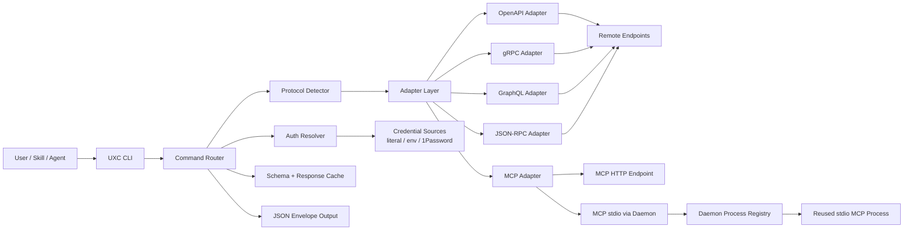

# UXC

**通用 X 协议命令行工具（Universal X-Protocol CLI）**

[English](README.md) | 简体中文

[](https://github.com/holon-run/uxc/actions)
[](https://github.com/holon-run/uxc/actions/workflows/coverage.yml)
[](https://opensource.org/licenses/MIT)
[](https://www.rust-lang.org)

UXC 是一个通用 X 协议 CLI，可直接通过 URL 发现并调用 OpenAPI、gRPC、GraphQL、MCP 和 JSON-RPC 接口。

它可以把远端“可由 schema 描述”的接口，转成可执行的命令行操作，不需要 SDK、代码生成，也不需要预注册 endpoint。

## 什么是 UXC

现代服务越来越多地暴露机器可读的接口元数据。
UXC 把这些 schema 当作运行时执行契约：

- 从主机发现操作
- 查看操作输入/输出
- 使用结构化输入执行调用
- 默认返回确定性的 JSON envelope

如果目标能描述自己，UXC 通常就能调用它。

## 为什么要做 UXC

团队和 agent 经常要处理多种协议风格：
OpenAPI、GraphQL、gRPC、MCP、JSON-RPC。

传统方式会带来重复成本：

- 语言相关的 SDK 初始化
- 与服务端真实能力逐渐漂移的生成客户端
- 每个 endpoint 单独写一层 wrapper
- 在 agent prompt 中嵌入很大的工具 schema

UXC 提供了一个跨协议、URL-first 的统一 CLI 契约。

## 为什么 UXC 适合 Skill

UXC 对 skill-based agent 很实用：

- 按需发现与调用，不需要把大体量 MCP 工具定义预加载进 prompt
- 通过 endpoint URL + auth 绑定实现可移植，不依赖每个用户本地 MCP server 名称
- 作为共享执行层，可被多个 skill 复用

## 核心能力

- URL-first 使用方式：直接调用 endpoint，不需要先定义 server alias
- 多协议检测与 adapter 路由
- 基于 schema 的操作发现（`<host> -h`, `<host> <operation_id> -h`）
- 结构化调用（位置 JSON、key=value）
- 面向自动化与 agent 的确定性 JSON envelope
- 可复用凭证与 endpoint 绑定的认证模型
- 通过 `uxc link` 提供 host 快捷命令

支持协议：

- OpenAPI / Swagger
- gRPC（server reflection）
- GraphQL（introspection）
- MCP（HTTP 和 stdio）
- JSON-RPC（基于 OpenRPC 发现）

## 架构快照

UXC 将协议差异统一到一个执行契约之下：



这个设计保持调用体验稳定，同时允许各协议内部实现独立演进。

## 目标使用场景

- 需要确定性远端工具调用的 AI agent 与 skill
- 不想做 SDK 初始化、希望基于 schema 直接调用的 CI/CD 与自动化任务
- 用统一命令契约做跨协议集成测试
- 需要 JSON envelope 与可预测错误模型的受控运行环境

## 非目标

UXC 不是：

- 代码生成器
- SDK 框架
- API 网关或反向代理

UXC 的定位是：schema 暴露能力的执行接口。

## 安装

### Homebrew（macOS/Linux）

```bash
brew tap holon-run/homebrew-tap
brew install uxc
```

### 安装脚本（macOS/Linux）

```bash
curl -fsSL https://raw.githubusercontent.com/holon-run/uxc/main/scripts/install.sh | bash
```

运行前可先审阅脚本：

```bash
curl -fsSL https://raw.githubusercontent.com/holon-run/uxc/main/scripts/install.sh -o install-uxc.sh
less install-uxc.sh
bash install-uxc.sh
```

安装指定版本：

```bash
curl -fsSL https://raw.githubusercontent.com/holon-run/uxc/main/scripts/install.sh | bash -s -- -v v0.6.0
```

Windows 说明：不再支持原生 Windows，请通过 WSL 运行 UXC。

### Cargo

```bash
cargo install uxc
```

### 从源码安装

```bash
git clone https://github.com/holon-run/uxc.git
cd uxc
cargo install --path .
```

## 快速开始（3 分钟）

多数 HTTP 示例省略协议前缀。
对于公网主机，UXC 在省略时默认推断为 `https://`。

1. 发现操作：

```bash
uxc petstore3.swagger.io/api/v3 -h
```

2. 查看操作 schema：

```bash
uxc petstore3.swagger.io/api/v3 get:/pet/{petId} -h
```

3. 使用结构化输入执行调用：

```bash
uxc petstore3.swagger.io/api/v3 get:/pet/{petId} petId=1
```

仅使用以下 endpoint 形式：
- `uxc <host> -h`
- `uxc <host> <operation_id> -h`
- `uxc <host> <operation_id> key=value` 或 `uxc <host> <operation_id> '{...}'`

## 协议示例（每种一个）

`operation_id` 约定：

- OpenAPI：`method:/path`（例如 `get:/users/{id}`）
- gRPC：`Service/Method`
- GraphQL：`query/viewer`、`mutation/createUser`
- MCP：工具名（例如 `ask_question`）
- JSON-RPC：方法名（例如 `eth_getBalance`）

### OpenAPI

```bash
uxc petstore3.swagger.io/api/v3 -h
uxc petstore3.swagger.io/api/v3 get:/pet/{petId} petId=1
```

对于 schema 与服务地址分离的服务，可覆盖 schema 来源：

```bash
uxc api.github.com -h \
  --schema-url https://raw.githubusercontent.com/github/rest-api-description/main/descriptions/api.github.com/api.github.com.json
```

### gRPC

```bash
uxc grpcb.in:9000 -h
uxc grpcb.in:9000 addsvc.Add/Sum a=1 b=2
```

说明：gRPC unary 运行时调用依赖 `grpcurl` 在 `PATH` 中可用。

### GraphQL

```bash
uxc countries.trevorblades.com -h
uxc countries.trevorblades.com query/country code=US
```

### MCP

```bash
uxc mcp.deepwiki.com/mcp -h
uxc mcp.deepwiki.com/mcp ask_question repoName=holon-run/uxc question='What does this project do?'
```

### MCP（stdio）

UXC 也可以通过 stdio 调用本地进程启动的 MCP server。
对 stdio endpoint 来说，“URL”就是一个带引号的命令行。

Playwright MCP（stdio）示例：

```bash
# 一次性发现
uxc "npx -y @playwright/mcp@latest --headless --isolated" -h

# 为重复使用创建稳定命令名（推荐）
uxc link playwright-mcp-cli "npx -y @playwright/mcp@latest --headless --isolated"
playwright-mcp-cli -h

# 调用前先查看操作 schema
playwright-mcp-cli browser_navigate -h

# 使用 key=value 调用
playwright-mcp-cli browser_navigate url=https://example.com
playwright-mcp-cli browser_snapshot
```

### JSON-RPC

```bash
uxc fullnode.mainnet.sui.io -h
uxc fullnode.mainnet.sui.io sui_getLatestCheckpointSequenceNumber
```

## Skills

UXC 提供一个标准 skill（`uxc`）和若干官方场景化 wrapper skill。
建议把 `uxc` 作为共享执行层，再按场景补充 wrapper。

| Skill | 用途 | 路径 |
| --- | --- | --- |
| `uxc` | 标准的 schema 发现与多协议执行层 | [`skills/uxc/SKILL.md`](skills/uxc/SKILL.md) |
| `deepwiki-mcp-skill` | 查询仓库文档并回答代码库问题 | [`skills/deepwiki-mcp-skill/SKILL.md`](skills/deepwiki-mcp-skill/SKILL.md) |
| `context7-mcp-skill` | 通过 MCP 查询最新库文档与示例 | [`skills/context7-mcp-skill/SKILL.md`](skills/context7-mcp-skill/SKILL.md) |
| `okx-mcp-skill` | 通过 OKX MCP 执行 token、市场、钱包、换汇等流程 | [`skills/okx-mcp-skill/SKILL.md`](skills/okx-mcp-skill/SKILL.md) |
| `notion-mcp-skill` | 提供带 OAuth 说明的 Notion MCP 流程指引 | [`skills/notion-mcp-skill/SKILL.md`](skills/notion-mcp-skill/SKILL.md) |
| `playwright-mcp-skill` | 通过 `uxc` 在 MCP stdio 上运行 `@playwright/mcp`（浏览器自动化） | [`skills/playwright-mcp-skill/SKILL.md`](skills/playwright-mcp-skill/SKILL.md) |

安装和维护规则见 [`docs/skills.md`](docs/skills.md)。

## 输出与帮助约定

UXC 默认输出 JSON。
需要人类可读输出时，使用 `--text`（或 `--format text`）。

示例：

```bash
uxc
uxc help
uxc <host> -h
uxc <host> <operation_id> -h
uxc --text help
```

说明：在 endpoint 路由中，`help` 会被当作操作名，而不是帮助别名。

成功 envelope 形状：

```json
{
  "ok": true,
  "kind": "call_result",
  "protocol": "openapi",
  "endpoint": "https://petstore3.swagger.io/api/v3",
  "operation": "get:/pet/{petId}",
  "data": {},
  "meta": {
    "version": "v1",
    "duration_ms": 128
  }
}
```

对 MCP `tools/call`，`data` 可能包含 `content`、可选 `structuredContent` 和可选 `isError`。

失败 envelope 形状：

```json
{
  "ok": false,
  "error": {
    "code": "INVALID_ARGUMENT",
    "message": "Field 'id' must be an integer"
  },
  "meta": {
    "version": "v1"
  }
}
```

## 认证（凭证 + 绑定）

UXC 认证由两类资源组成：

- Credential：密钥材料和认证类型
- Binding：endpoint 匹配规则，用于选择 credential

示例：

```bash
uxc auth credential set deepwiki --auth-type bearer --secret-env DEEPWIKI_TOKEN
uxc auth credential set deepwiki --secret-op op://Engineering/deepwiki/token
uxc auth binding add --id deepwiki-mcp --host mcp.deepwiki.com --path-prefix /mcp --scheme https --credential deepwiki --priority 100

# api_key 支持可配置的 header 名称和模板
uxc auth credential set okx --auth-type api_key --secret-env OKX_ACCESS_KEY --api-key-header OK-ACCESS-KEY
uxc auth credential set okx-advanced --auth-type api_key --header "OK-ACCESS-KEY={{secret}}" --header "OK-ACCESS-PASSPHRASE={{env:OKX_PASSPHRASE}}"
```

对 `--secret-op`，secret 在请求运行时通过 daemon 解析。
请确保 daemon 有可用的 1Password 认证上下文（例如 `OP_SERVICE_ACCOUNT_TOKEN`），并在环境变量变化后重启 daemon。

MCP HTTP 也支持 OAuth（device code、client credentials、authorization code + PKCE）。
完整流程见 [`docs/oauth-mcp-http.md`](docs/oauth-mcp-http.md)。

## 文档导航

- 扩展 quickstart 与协议 walkthrough：[`docs/quickstart.md`](docs/quickstart.md)
- 无需 key 的公开 endpoint（协议检查）：[`docs/public-endpoints.md`](docs/public-endpoints.md)
- `RUST_LOG` 日志与排障：[`docs/logging.md`](docs/logging.md)
- Auth secret 来源（`literal/env/op`）：[`docs/auth-secret-sources.md`](docs/auth-secret-sources.md)
- 通过服务管理器运行 daemon（`systemd`/`launchd`）：[`docs/daemon-service.md`](docs/daemon-service.md)
- OpenAPI schema mapping 与 `--schema-url`：[`docs/schema-mapping.md`](docs/schema-mapping.md)
- Skills 概览与安装/维护：[`docs/skills.md`](docs/skills.md)
- 发布流程：[`docs/release.md`](docs/release.md)

## 贡献

欢迎贡献。

- 开发流程与质量标准：[`CONTRIBUTING.md`](CONTRIBUTING.md)
- CI 与发布流程：[GitHub Actions](https://github.com/holon-run/uxc/actions)

## 许可证

MIT License，见 [`LICENSE`](LICENSE)。
